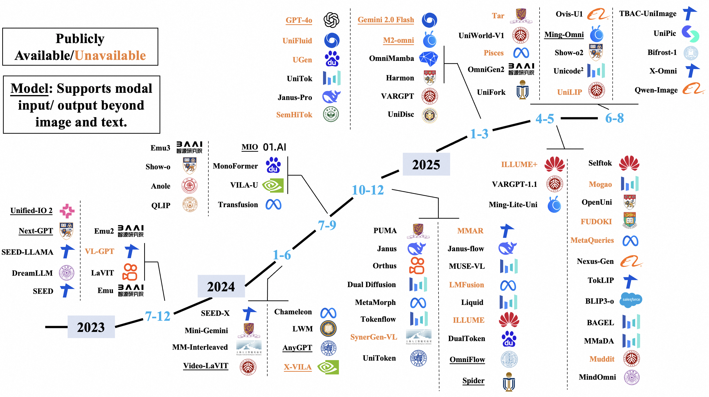
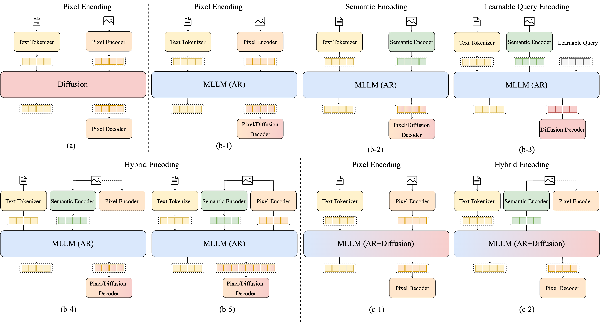

[//]: # "# Awesome Unified Multimodal Models"

[//]: #
[//]: # "## Survey "

<div align="center"> <h1 style="font-size: 3em; margin-bottom: 0.2em;">Awesome Unified Multimodal Models</h1> </div>
<div align="center" style="font-size: 2em;"> <a href="https://arxiv.org/abs/2505.02567" target="_blank">📚Survey</a> • 🤗 <a href="https://huggingface.co/papers/2505.02567" target="_blank">HF Repo</a> </div>

##


*Figure 1: Timeline of Publicly Available and Unavailable Unified Multimodal Models. The models are categorized by their release years, from 2023 to 2025. Models underlined in the diagram represent any-to-any multimodal models, capable of handling inputs or outputs beyond text and image, such as audio, video, and speech. The timeline highlights the rapid growth in this field.*

## 🔥 We are hiring!

We are looking for both interns and full-time researchers to join our team, focusing on multimodal understanding, generation, reasoning, AI agents, and unified multimodal models. If you are interested in exploring these exciting areas, please reach out to us at qingguo.cqg@alibaba-inc.com.

## 👉 What is This Repo for?

This repository provides a comprehensive collection of resources related to unified multimodal models, featuring:
- A survey of advances, challenges, and timelines for unified models  
- Categorized lists of diffusion-based, autoregressive (MLLM), and hybrid architectures for unified image–text understanding and generation  
- Benchmarks for evaluating multimodal comprehension, image generation, and interleaved image–text tasks  
- Representative datasets covering multimodal understanding, text-to-image synthesis, image editing, and interleaved interactions  

Designed to help researchers and practitioners explore, compare, and build state-of-the-art unified multimodal systems.


## Awesome Papers & Datasets
- [Text-and-Image Unified Models](#text-and-image-unified-models)
    - [Diffusion](#diffusion)
    - [MLLM AR](#mllm-ar)
    - [MLLM AR-Diffusion](#mllm-ar-diffusion)
- [Any-to-Any Multimodal models](#any-to-any-multimodal-models)
- [Benchmark for Evaluation](#benchmark-for-evaluation)
    - [Benchmarks on Understanding Tasks](#benchmarks-on-understanding-tasks)
    - [Benchmarks on Image Generation Tasks](#benchmarks-on-image-generation-tasks)
    - [Benchmarks on Interleaved Tasks](#benchmarks-on-interleaved-tasks)
- [Dataset](#dataset)
    - [Multimodal Understanding](#multimodal-understanding)
    - [Text-to-Image](#text-to-image)
    - [Image Editing](#image-editing)
    - [Interleaved Image-Text](#interleaved-image-text)
    - [Other Text+Image-to-Image](#other-text-image-to-image)
- [Applications and Opportunities](#applications-and-opportunities)

### Text-and-Image Unified Models


*Figure 2: Classification of Unified Multimodal Understanding and Generation Models. The models are divided into three main categories based on their backbone architecture: Diffusion, MLLM (AR), and MLLM (AR + Diffusion). Each category is further subdivided according to the encoding strategy employed, including Pixel Encoding, Semantic Encoding, Learnable Query Encoding, and Hybrid Encoding. We illustrate the architectural variations within these categories and their corresponding encoder-decoder configurations.*

#### Diffusion
|       Name       | Title                                                                                                                                                                                                                                                           | Venue | Date       | Code                                                         | Demo                                                                 |
| :-------------------------------------------------------------------------------------------------------------------------------------------------------------------------------------------------------------------------------------------------------------- | :---- | :--------- | :----------------------------------------------------------- | :------------------------------------------------------------------- |:---|
| Muddit | [Muddit: Liberating Generation Beyond Text-to-Image with a Unified Discrete Diffusion Model](https://arxiv.org/abs/2505.23606)  | arXiv | 2025/05/23 | [Github](https://github.com/M-E-AGI-Lab/Muddit) | - |
| FUDOKI | [FUDOKI: Discrete Flow-based Unified Understanding and Generation via Kinetic-Optimal Velocities](https://arxiv.org/abs/2505.20147) | arXiv | 2025/05/20 | - | - |
|       MMaDA       | [MMaDA: Multimodal Large Diffusion Language Models](https://arxiv.org/abs/2505.15809)                                                             | arXiv | 2025/05/21 | [Github](https://github.com/Gen-Verse/MMaDA)     | [Demo](https://huggingface.co/spaces/Gen-Verse/MMaDA)                                                                    |
| UniDisc | [Unified Multimodal Discrete Diffusion](https://arxiv.org/abs/2503.20853)  | arXiv | 2025/03/20 | [Github](https://github.com/alexanderswerdlow/unidisc) | - |
|       Dual Diffusion       | [Dual Diffusion for Unified Image Generation and Understanding](https://arxiv.org/abs/2501.00289)                                                             | arXiv | 2024/12/31 | [Github](https://github.com/zijieli-Jlee/Dual-Diffusion)     | -                                                                    |


#### MLLM AR

##### b-1: Pixel Encoding

| Name | Title | Venue | Date | Code | Demo |
| ---- | ----- | ----- | ---- | ---- | ---- |
| Selftok | [Selftok: Discrete Visual Tokens of Autoregression, by Diffusion, and for Reasoning](https://arxiv.org/abs/2505.07538)  | arXiv | 2025/05/12 | [Github](https://github.com/selftok-team/SelftokTokenizer) | -    |
| TokLIP | [TokLIP: Marry Visual Tokens to CLIP for Multimodal Comprehension and Generation](https://www.arxiv.org/abs/2505.05422)  | arXiv | 2025/05/08 | [Github](https://github.com/TencentARC/TokLIP) | -    |
| Harmon | [Harmonizing Visual Representations for Unified Multimodal Understanding and Generation](https://arxiv.org/abs/2503.21979)  | arXiv | 2025/03/27 | [Github](https://github.com/wusize/Harmon) | [Demo](https://huggingface.co/spaces/wusize/Harmon) |
| UGen | [UGen: Unified Autoregressive Multimodal Model with Progressive Vocabulary Learning](https://arxiv.org/abs/2503.21193) | arXiv | 2025/03/27 | -    | -    |
| SynerGen-VL | [SynerGen-VL: Towards Synergistic Image Understanding and Generation with Vision Experts and Token Folding](https://arxiv.org/abs/2412.09604) | arXiv | 2024/12/12 | -    | -    |
| Liquid | [Liquid: Language Models are Scalable and Unified Multi-modal Generators](https://arxiv.org/abs/2412.04332)  | arXiv | 2024/12/05 | [Github](https://github.com/FoundationVision/Liquid) | [Demo](https://huggingface.co/spaces/Junfeng5/Liquid_demo) |
| Orthus | [Orthus: Autoregressive Interleaved Image-Text Generation with Modality-Specific Heads](https://arxiv.org/abs/2412.00127)  | arXiv | 2024/11/28 | [Github](https://github.com/zhijie-group/Orthus) | -    |
| MMAR | [MMAR: Towards Lossless Multi-Modal Auto-Regressive Probabilistic Modeling](https://arxiv.org/abs/2410.10798) | arXiv | 2024/10/14 | -    | -    |
| Emu3 | [Emu3: Next-Token Prediction is All You Need](https://arxiv.org/abs/2409.18869)  | arXiv | 2024/09/27 | [Github](https://github.com/baaivision/Emu3) | [Demo](https://huggingface.co/spaces/BAAI/Emu3) |
| ANOLE | [ANOLE: An Open, Autoregressive, Native Large Multimodal Models for Interleaved Image-Text Generation](https://arxiv.org/abs/2407.06135)  | arXiv | 2024/07/08 | [Github](https://github.com/GAIR-NLP/anole) | -    |
| Chameleon | [Chameleon: Mixed-Modal Early-Fusion Foundation Models](https://arxiv.org/abs/2405.09818)  | arXiv | 2024/05/16 | [Github](https://github.com/facebookresearch/chameleon) | -    |
| LWM  | [World Model on Million-Length Video And Language With Blockwise RingAttention](https://arxiv.org/abs/2402.08268)  | ICLR | 2024/02/13 | [Github](https://github.com/LargeWorldModel/LWM) | - |

##### b-2: Semantic Encoding
| Name | Title | Venue | Date | Code | Demo |
| ---- | ----- | ----- | ---- | ---- | ---- |
| Bifrost-1 | [Bifrost-1: Bridging Multimodal LLMs and Diffusion Models with Patch-level CLIP Latents](https://arxiv.org/abs/2508.05954)  | arXiv | 2025/08/08 | [GitHub](https://github.com/HL-hanlin/Bifrost-1) | -    |
| Qwen-Image | [Qwen-Image Technical Report](https://arxiv.org/abs/2508.02324)  | arXiv | 2025/08/04 | [GitHub](https://github.com/QwenLM/Qwen-Image) | [Demo](https://huggingface.co/spaces/Qwen/Qwen-Image)    |
| X-Omni | [X-Omni: Reinforcement Learning Makes Discrete Autoregressive Image Generative Models Great Again](https://arxiv.org/abs/2507.22058)  | arXiv | 2025/07/29 | [GitHub](https://github.com/X-Omni-Team/X-Omni) | [Demo](https://huggingface.co/collections/X-Omni/x-omni-spaces-6888c64f38446f1efc402de7)    |
| Ovis-U1 | [Ovis-U1 Technical Report](https://arxiv.org/abs/2506.23044)  | arXiv | 2025/06/28 | [GitHub](https://github.com/AIDC-AI/Ovis-U1) | [Demo](https://huggingface.co/spaces/AIDC-AI/Ovis-U1-3B)    |
| UniCode$^2$ | [UniCode$^2$: Cascaded Large-scale Codebooks for Unified Multimodal Understanding and Generation](https://arxiv.org/abs/2506.20214)  | arXiv | 2025/06/20 | - | -    |
| OmniGen2 | [OmniGen2: Exploration to Advanced Multimodal Generation](https://arxiv.org/abs/2506.18871)  | arXiv | 2025/06/18 | [Github](https://github.com/VectorSpaceLab/OmniGen2) | [Demo](https://huggingface.co/spaces/OmniGen2/OmniGen2) |
| Tar | [Vision as a Dialect: Unifying Visual Understanding and Generation via Text-Aligned Representations](https://arxiv.org/abs/2506.18898)  | arXiv | 2025/06/18 | [Github](https://github.com/csuhan/Tar) | [Demo](https://tar.csuhan.com/) |
| UniFork | [UniFork: Exploring Modality Alignment for Unified Multimodal Understanding and Generation](https://arxiv.org/abs/2506.17202)  | arXiv | 2025/06/17 | [Github](https://github.com/tliby/UniFork) | -    |
| UniWorld | [UniWorld: High-Resolution Semantic Encoders for Unified Visual Understanding and Generation](https://arxiv.org/abs/2506.03147)  | arXiv | 2025/06/03 | [Github](https://github.com/PKU-YuanGroup/UniWorld-V1) | -    |
| Pisces | [Pisces: An Auto-regressive Foundation Model for Image Understanding and Generation](https://arxiv.org/abs/2506.10395)  | arXiv | 2025/06/10 | [Github](https://github.com/PKU-YuanGroup/UniWorld-V1) | -    |
| DualToken | [DualToken: Towards Unifying Visual Understanding and Generation with Dual Visual Vocabularies](https://arxiv.org/abs/2503.14324)  | arXiv | 2025/03/18 | [Github](https://github.com/songweii/dualtoken) | -    |
| UniTok | [UniTok: A Unified Tokenizer for Visual Generation and Understanding](https://arxiv.org/abs/2502.20321)  | arXiv | 2025/02/27 | [Github](https://github.com/FoundationVision/UniTok) | [Demo](https://huggingface.co/spaces/FoundationVision/UniTok) |
| QLIP | [QLIP: Text-Aligned Visual Tokenization Unifies Auto-Regressive Multimodal Understanding and Generation](https://arxiv.org/abs/2502.05178)  | arXiv | 2025/02/05 | [Github](https://github.com/NVlabs/QLIP) | - |
| MetaMorph | [MetaMorph: Multimodal Understanding and Generation via Instruction Tuning](https://arxiv.org/abs/2412.14164)  | arXiv | 2024/12/18 | [Github](https://github.com/facebookresearch/metamorph/) | -    |
| ILLUME | [ILLUME: Illuminating Your LLMs to See, Draw, and Self-Enhance](https://arxiv.org/abs/2412.06673) | arXiv | 2024/12/09 | -    | -    |
| PUMA | [PUMA: Empowering Unified MLLM with Multi-granular Visual Generation](https://arxiv.org/abs/2410.13861)  | arXiv | 2024/10/17 | [Github](https://github.com/rongyaofang/PUMA) | -    |
| VILA-U | [VILA-U: a Unified Foundation Model Integrating Visual Understanding and Generation](https://arxiv.org/abs/2409.04429)  | ICLR | 2024/09/06 | [Github](https://github.com/mit-han-lab/vila-u) | [Demo](https://vila-u.hanlab.ai/) |
| Mini-Gemini | [Mini-Gemini: Mining the Potential of Multi-modality Vision Language Models](https://arxiv.org/abs/2403.18814)  | arXiv | 2024/03/27 | [Github](https://github.com/dvlab-research/MGM) | [Demo](http://103.170.5.190:7860/) |
| MM-Interleaved | [MM-Interleaved: Interleaved Image-Text Generative Modeling via Multi-modal Feature Synchronizer](https://arxiv.org/abs/2401.10208)  | arXiv | 2024/01/18 | [Github](https://github.com/OpenGVLab/MM-Interleaved) | -    |
| VL-GPT | [VL-GPT: A Generative Pre-trained Transformer for Vision and Language Understanding and Generation](https://arxiv.org/abs/2312.09251)  | arXiv | 2023/12/14 | [Github](https://github.com/AILab-CVC/VL-GPT) | -    |
| Emu2 | [Generative Multimodal Models are In-Context Learners](https://arxiv.org/abs/2312.13286)  | CVPR | 2023/12/10 | [Github](https://github.com/baaivision/Emu) | [Demo](http://218.91.113.230:9002/) |
| DreamLLM | [DreamLLM: Synergistic Multimodal Comprehension and Creation](https://arxiv.org/abs/2309.11499)  | ICLR | 2023/09/20 | [Github](https://github.com/RunpeiDong/DreamLLM) | -    |
| LaVIT | [Unified Language-Vision Pretraining in LLM with Dynamic Discrete Visual Tokenization](https://arxiv.org/abs/2309.04669)  | ICLR | 2023/09/09 | [Github](https://github.com/jy0205/LaVIT) | -    |
| Emu  | [Emu: Generative Pretraining in Multimodality](https://arxiv.org/abs/2307.05222)  | ICLR | 2023/07/11 | [Github](https://github.com/baaivision/Emu) | [Demo](http://218.91.113.230:9002/) |

##### b-3: Learnable Query Encoding
|       Name       | Title                                                                                                                                                                                                                                                           | Venue | Date       | Code                                                         | Demo                                                                 |
| :-------------------------------------------------------------------------------------------------------------------------------------------------------------------------------------------------------------------------------------------------------------- | :---- | :--------- | :----------------------------------------------------------- | :------------------------------------------------------------------- |:----|
|       TBAC-UniImage       | [TBAC-UniImage: Unified Understanding and Generation by Ladder-Side Diffusion Tuning](https://arxiv.org/abs/2508.08098)  | arXiv | 2025/08/11 | [Github](https://github.com/DruryXu/TBAC-UniImage)            | -        |
|       UniLIP        | [UniLiP: Adapting CLIP for Unified Multimodal Understanding, Generation and Editing](https://arxiv.org/abs/2507.23278) | arXiv | 2025/07/31 | -          |  -      |
| Ming-Omni | [Ming-Omni: A Unified Multimodal Model for Perception and Generation](https://arxiv.org/abs/2506.09344) | arXiv | 2025/06/09 | - | -    |
| OpenUni | [OpenUni: A Simple Baseline for Unified Multimodal Understanding and Generation](https://arxiv.org/abs/2505.23661)  | arXiv | 2025/05/23 | [Github](https://github.com/wusize/OpenUni) | -    |
| BLIP3-o | [BLIP3-o: A Family of Fully Open Unified Multimodal Models-Architecture, Training and Dataset](https://arxiv.org/abs/2505.09568)  | arXiv | 2025/05/14 | [Github](https://github.com/JiuhaiChen/BLIP3o) | -    |
|       Ming-Lite-Uni       | [Ming-Lite-Uni: Advancements in Unified Architecture for Natural Multimodal Interaction](https://arxiv.org/abs/2505.02471)  | arXiv | 2025/05/05 | [Github](https://github.com/inclusionAI/Ming/tree/main/Ming-unify)       | -                                                                    |
|       Nexus-Gen       | [Nexus-Gen: A Unified Model for Image Understanding, Generation, and Editing](https://arxiv.org/abs/2404.14396)                                                | arXiv | 2025/04/30 | [Github](https://github.com/modelscope/Nexus-Gen)                | [Demo](https://www.modelscope.cn/studios/DiffSynth-Studio/Nexus-Gen)               |
|       MetaQueries       | [Transfer between Modalities with MetaQueries](https://arxiv.org/abs/2504.06256)                                                                                                                                                                                | arXiv | 2025/04/08 | -                                                            | -                                                                    |
|       SEED-X       | [SEED-X: Multimodal Models with Unified Multi-granularity Comprehension and Generation](https://arxiv.org/abs/2404.14396)                                                | arXiv | 2024/04/22 | [Github](https://github.com/AILab-CVC/SEED-X)                | [Demo](https://arc.tencent.com/en/ai-demos/multimodal)               |
|       SEED-LLaMA       | [Making LLaMA SEE and Draw with SEED Tokenizer](https://arxiv.org/abs/2310.01218)                                                                                          | ICLR  | 2023/10/02 | [Github](https://github.com/AILab-CVC/SEED)                  | [Demo](https://huggingface.co/spaces/AILab-CVC/SEED-LLaMA)           |
|       SEED       | [Planting a SEED of Vision in Large Language Model](https://arxiv.org/abs/2307.08041)                                                                                      | arXiv | 2023/07/16 | [Github](https://github.com/AILab-CVC/SEED)                  | [Demo](https://huggingface.co/spaces/AILab-CVC/SEED-LLaMA)           |

##### b-4: Hybrid Encoding (Pseduo)
|       Name       | Title                                                                                                                                                                                                                                                           | Venue | Date       | Code                                                         | Demo                                                                 |
| :-------------------------------------------------------------------------------------------------------------------------------------------------------------------------------------------------------------------------------------------------------------- | :---- | :--------- | :----------------------------------------------------------- | :------------------------------------------------------------------- |:-----|
| Skywork UniPic | [Skywork UniPic: Unified Autoregressive Modeling for Visual Understanding and Generation](https://arxiv.org/abs/2506.15564)  | arXiv | 2025/08/05 | [Github](https://github.com/SkyworkAI/UniPic) | [Demo](https://huggingface.co/spaces/Skywork/UniPic) |
|       MindOmni       | [MindOmni: Unleashing Reasoning Generation in Vision Language Models with RGPO](https://arxiv.org/abs/2505.13031)  | arXiv | 2025/05/13 | [Github](https://github.com/TencentARC/MindOmni)            | [Demo](https://huggingface.co/spaces/stevengrove/MindOmni)          |
|       UniFluid       | [Unified Autoregressive Visual Generation and Understanding with Continuous Tokens](https://arxiv.org/abs/2503.13436)                                                                                                                                           | arXiv | 2025/03/17 | -                                                            | -                                                                    |
|       OmniMamba       | [OmniMamba: Efficient and Unified Multimodal Understanding and Generation via State Space Models](https://arxiv.org/abs/2503.08686)                                      | arXiv | 2025/03/11 | [Github](https://github.com/hustvl/OmniMamba)                | -                                                                    |
|       Janus-Pro       | [Janus-Pro: Unified Multimodal Understanding and Generation with Data and Model Scaling](https://arxiv.org/abs/2501.17811)                                               | arXiv | 2025/01/29 | [Github](https://github.com/deepseek-ai/Janus)               | [Demo](https://huggingface.co/spaces/deepseek-ai/Janus-Pro-7B)     |
|       Janus       | [Janus: Decoupling Visual Encoding for Unified Multimodal Understanding and Generation](https://arxiv.org/abs/2410.13848)                                               | arXiv | 2024/10/17 | [Github](https://github.com/deepseek-ai/Janus)               | [Demo](https://huggingface.co/spaces/deepseek-ai/Janus-1.3B)     |


##### b-5: Hybrid Encoding (Joint)
| Name | Title | Venue | Date | Code | Demo |
| ---- | ----- | ----- | ---- | ---- | ---- |
| Show-o2 | [Show-o2: Improved Native Unified Multimodal Models](https://arxiv.org/abs/2506.15564)  | arXiv | 2025/06/15 | [Github](https://github.com/showlab/Show-o/tree/main/show-o2) | - |
| UniToken | [UniToken: Harmonizing Multimodal Understanding and Generation through Unified Visual Encoding](https://arxiv.org/abs/2504.04423)  | CVPRW | 2025/04/06 | [Github](https://github.com/SxJyJay/UniToken) | -    |
| VARGPT-v1.1 | [VARGPT-v1.1: Improve Visual Autoregressive Large Unified Model via Iterative Instruction Tuning and Reinforcement Learning](https://arxiv.org/abs/2504.02949)  | arXiv | 2025/04/03 | [Github](https://github.com/VARGPT-family/VARGPT-v1.1) | -    |
| ILLUME+ | [ILLUME+: Illuminating Unified MLLM with Dual Visual Tokenization and Diffusion Refinement](https://arxiv.org/abs/2504.01934)  | arXiv | 2025/04/02 | [Github](https://github.com/illume-unified-mllm/ILLUME_plus) | -    |
| SemHiTok | [SemHiTok: A Unified Image Tokenizer via Semantic-Guided Hierarchical Codebook for Multimodal Understanding and Generation](https://arxiv.org/abs/2503.06764) | arXiv | 2025/03/06 | - | - |
| VARGPT | [VARGPT: Unified Understanding and Generation in a Visual Autoregressive Multimodal Large Language Model](https://arxiv.org/abs/2501.12327)  | arXiv | 2025/01/21 | [Github](https://github.com/VARGPT-family/VARGPT) | -    |
| TokenFlow | [TokenFlow: Unified Image Tokenizer for Multimodal Understanding and Generation](https://arxiv.org/abs/2412.03069)  | CVPR | 2024/12/04 | [Github](https://github.com/ByteFlow-AI/TokenFlow) | -    |
| MUSE-VL | [MUSE-VL: Modeling Unified VLM through Semantic Discrete Encoding](https://arxiv.org/abs/2411.17762) | arXiv | 2024/11/26 | -    | -    |

#### MLLM AR-Diffusion
##### c-1: Pxiel Encoding
|       Name       | Title                                                                                                                                                                                                                                                           | Venue | Date       | Code                                                         | Demo                                                                 |
| :-------------------------------------------------------------------------------------------------------------------------------------------------------------------------------------------------------------------------------------------------------------- | :---- | :--------- | :----------------------------------------------------------- | :------------------------------------------------------------------- |:----|
|       LMFusion       | [LMFusion: Adapting Pretrained Language Models for Multimodal Generation](https://arxiv.org/abs/2412.15188)                                                                                                                                                     | arXiv | 2024/12/19 | -                                | -                                                                    |
|       MonoFormer       | [MonoFormer: One Transformer for Both Diffusion and Autoregression](https://arxiv.org/abs/2409.16280)                                                               | arXiv | 2024/09/24 | [Github](https://github.com/MonoFormer/MonoFormer)           | -                                                                    |
|       Show-o       | [Show-o: One Single Transformer to Unify Multimodal Understanding and Generation](https://arxiv.org/abs/2408.12528)                                                        | ICLR | 2024/08/22 | [Github](https://github.com/showlab/Show-o)                  | [Demo](https://huggingface.co/spaces/showlab/Show-o)                 |
|       Transfusion       | [Transfusion: Predict the Next Token and Diffuse Images with One Multi-Modal Model](https://arxiv.org/abs/2408.11039)                                      | ICLR | 2024/08/20 | [Github](https://github.com/lucidrains/transfusion-pytorch)  | -                                                                    |

##### c-2: Hybrid Encoding (Pseduo)
| Name | Title | Venue | Date | Code | Demo |
| ---- | ----- | ----- | ---- | ---- | ---- |
| BAGEL | [Emerging Properties in Unified Multimodal Pretraining](https://arxiv.org/abs/2505.14683)  | arXiv | 2025/05/20 | [Github](https://github.com/bytedance-seed/BAGEL) | [Demo](https://demo.bagel-ai.org/) |
| Mogao | [Mogao: An Omni Foundation Model for Interleaved Multi-Modal Generation](https://arxiv.org/abs/2505.05472) | arXiv | 2025/05/08 | -    | -    |
| JanusFlow | [JanusFlow: Harmonizing Autoregression and Rectified Flow for Unified Multimodal Understanding and Generation](https://arxiv.org/abs/2411.07975)  | arXiv | 2024/11/12 | [Github](https://github.com/deepseek-ai/Janus) | [Demo](https://huggingface.co/spaces/deepseek-ai/JanusFlow-1.3B) |


### Any-to-Any Multimodal models

|       Name       | Title                                                                                                                                                                                                                        | Venue     | Date       | Code                                                | Demo |
| :--------------------------------------------------------------------------------------------------------------------------------------------------------------------------------------------------------------------------- | :-------- | :--------- | :-------------------------------------------------- | :--- |:---|
|       M2-omni       | [M2-omni: Advancing Omni-MLLM for Comprehensive Modality Support with Competitive Performance](https://arxiv.org/pdf/2502.18778)                          | arXiv | 2025/02/26 | - | -    |
|       OmniFlow       | [OmniFlow: Any-to-Any Generation with Multi-Modal Rectified Flows](https://arxiv.org/abs/2412.01169)                           | CVPR | 2024/12/02 | [Github](https://github.com/jacklishufan/OmniFlows) | -    |
|       Spider       | [Spider: Any-to-Many Multimodal LLM](https://arxiv.org/abs/2411.09439)                                                                  | arXiv     | 2024/11/14 | [Github](https://github.com/Layjins/Spider)         | -    |
|       MIO       | [MIO: A Foundation Model on Multimodal Tokens](https://arxiv.org/abs/2409.17692)                                                          | arXiv     | 2024/09/26 | [Github](https://github.com/MIO-Team/MIO)           |      |
|       X-VILA       | [X-VILA: Cross-Modality Alignment for Large Language Model](https://arxiv.org/abs/2405.19335)                                                                                                                                | arXiv     | 2024/05/29 | -                                                   | -    |
|       AnyGPT       | [AnyGPT: Unified Multimodal LLM with Discrete Sequence Modeling](https://arxiv.org/abs/2402.12226)                                     | arXiv     | 2024/02/19 | [Github](https://github.com/OpenMOSS/AnyGPT)        | -    |
|       Video-LaVIT       | [Video-LaVIT: Unified Video-Language Pre-training with Decoupled Visual-Motional Tokenization](https://arxiv.org/abs/2402.03161)          | ICML | 2024/02/05 | [Github](https://github.com/jy0205/LaVIT)           | -    |
|       Unified-IO 2       | [Unified-IO 2: Scaling Autoregressive Multimodal Models with Vision, Language, Audio, and Action](https://arxiv.org/abs/2312.17172)  | CVPR | 2023/12/28 | [Github](https://github.com/allenai/unified-io-2)   | -    |
|       NExT-GPT       | [NExT-GPT: Any-to-Any Multimodal LLM](https://arxiv.org/abs/2309.05519)                                                             | ICML | 2023/09/11 | [Github](https://github.com/NExT-GPT/NExT-GPT)      | -    |

### Benchmark for Evaluation

#### Benchmarks on Understanding Tasks

|     Name      | Paper                                                                                                                                                                                                                                                   |  Venue  |    Date    |                                    Code                                     |
|:-------------:|:--------------------------------------------------------------------------------------------------------------------------------------------------------------------------------------------------------------------------------------------------------|:-------:|:----------:|:---------------------------------------------------------------------------:|
| General-Bench | [On Path to Multimodal Generalist: General-Level and General-Bench](https://arxiv.org/abs/2505.04620)                                             |  ICML   | 2025/05/07 |      [Github](https://github.com/path2generalist/General-Level)             |
|   MM-Vet v2   | [MM-Vet v2: A Challenging Benchmark to Evaluate Large Multimodal Models for Integrated Capabilities](https://arxiv.org/abs/2408.00765)                          |  arXiv  | 2024/08/01 |          [Github](https://github.com/yuweihao/MM-Vet/tree/main/v2)          |
|    OwlEval    | [mPLUG-Owl: Modularization Empowers Large Language Models with Multimodality](https://arxiv.org/abs/2304.14178)                                                |  arXiv  | 2024/04/27 |                [Github](https://github.com/X-PLUG/mPLUG-Owl)                |
|     oVQA      | [Open-ended VQA benchmarking of Vision-Language models by exploiting Classification datasets and their semantic hierarchy](https://arxiv.org/abs/2402.07270)  |  ICLR   | 2024/02/11 |               [Github](https://github.com/lmb-freiburg/ovqa)                |
| SEED-Bench-2  | [SEED-Bench-2: Benchmarking Multimodal Large Language Models](https://arxiv.org/abs/2311.17092)                                                            |  arXiv  | 2023/11/28 |  [Github](https://github.com/AILab-CVC/SEED-Bench/tree/main/SEED-Bench-2)   |
|     MMMU      | [MMMU: A Massive Multi-discipline Multimodal Understanding and Reasoning Benchmark for Expert AGI](https://arxiv.org/abs/2311.16502)                        |  CVPR   | 2023/11/27 |              [Github](https://github.com/MMMU-Benchmark/MMMU)               |
|    MM-Vet     | [MM-Vet: Evaluating Large Multimodal Models for Integrated Capabilities](https://arxiv.org/abs/2308.02490)                                                      |  ICML   | 2023/08/04 |                [Github](https://github.com/yuweihao/MM-Vet)                 |
|  SEED-Bench   | [SEED-Bench: Benchmarking Multimodal LLMs with Generative Comprehension](https://arxiv.org/abs/2307.16125)                                                 |  CVPR   | 2023/07/30 |              [Github](https://github.com/AILab-CVC/SEED-Bench)              |
|    MMBench    | [MMBench: Is Your Multi-modal Model an All-around Player?](https://arxiv.org/abs/2307.06281)                                                               |  ECCV   | 2023/07/12 |              [Github](https://github.com/open-compass/MMBench)              |
|     LAMM      | [LAMM: Language-Assisted Multi-Modal Instruction-Tuning Dataset, Framework, and Benchmark](https://arxiv.org/abs/2306.06687)                                      | NeurIPS | 2023/06/11 |                 [Github](https://github.com/OpenLAMM/LAMM)                  |
|   HaluEval    | [HaluEval: A Large-Scale Hallucination Evaluation Benchmark for Large Language Models](https://arxiv.org/abs/2305.11747)                                          |  EMNLP  | 2023/05/19 |               [Github](https://github.com/RUCAIBox/HaluEval)                |
|      GQA      | [GQA: A New Dataset for Real-World Visual Reasoning and Compositional Question Answering](https://arxiv.org/abs/1902.09506)                                    |  CVPR   | 2019/02/25 | [Github](https://github.com/salesforce/LAVIS/blob/main/dataset_card/gqa.md) |
|      VQA      | [VQA: Visual Question Answering](https://arxiv.org/abs/1505.00468)                                                                                                                                                                                      |  ICCV   | 2015/05/03 |               [ProjectPage](https://visualqa.org/index.html)                |


#### Benchmarks on Image Generation Tasks

|       Name        | Paper                                                                                                                                                                                                                                               |  Venue  |    Date    |                                     Code                                      |
|:-----------------:|:----------------------------------------------------------------------------------------------------------------------------------------------------------------------------------------------------------------------------------------------------|:-------:|:----------:|:-----------------------------------------------------------------------------:|
|       GenExam        | [GenExam: A Multidisciplinary Text-to-Image Exam](https://arxiv.org/abs/2509.14232)                                        |  arxiv  | 2025/09/18 |              [Github](https://github.com/OpenGVLab/GenExam)              |
|       CVTG        | [TextCrafter: Accurately Rendering Multiple Texts in Complex Visual Scenes](https://arxiv.org/abs/2503.23461)                                        |  arxiv  | 2025/08/05 |              [Github](https://github.com/NJU-PCALab/TextCrafter)              |
|    OneIG-Bench    | [OneIG-Bench: Omni-dimensional Nuanced Evaluation for Image Generation](https://arxiv.org/abs/2506.07977)                                       |  arxiv  | 2025/06/26 |           [Github](https://github.com/OneIG-Bench/OneIG-Benchmark)            |
| ComplexBench-Edit | [ComplexBench-Edit: Benchmarking Complex Instruction-Driven Image Editing via Compositional Dependencies](https://www.arxiv.org/abs/2506.12830)  |  arxiv  | 2025/06/15 |            [Github](https://github.com/llllly26/ComplexBench-Edit)            |
|   EditInspector   | [EditInspector: A Benchmark for Evaluation of Text-Guided Image Edits](https://arxiv.org/abs/2506.09988)                                                                                                                                            |  arxiv  | 2025/06/11 |                                       -                                       |
|  ByteMorph-Bench  | [ByteMorph: Benchmarking Instruction-Guided Image Editing with Non-Rigid Motions](https://arxiv.org/abs/2506.03107)                                  |  arxiv  | 2025/06/03 |              [Github](https://github.com/ByteDance-Seed/BM-code)              |
|   RefEdit-Bench   | [RefEdit: A Benchmark and Method for Improving Instruction-based Image Editing Model on Referring Expressions](https://arxiv.org/abs/2506.03448)   |  arxiv  | 2025/06/03 |             [Github](https://github.com/bimsarapathiraja/refedit)             |
|       WISE        | [WISE: A World Knowledge-Informed Semantic Evaluation for Text-to-Image Generation](https://arxiv.org/abs/2503.07265)                                    |  arxiv  | 2025/05/27 |                [Github](https://github.com/PKU-YuanGroup/WISE)                |
|   ImgEdit-Bench   | [ImgEdit: A Unified Image Editing Dataset and Benchmark](https://arxiv.org/abs/2505.20275)                                                            |  arxiv  | 2025/05/26 |              [Github](https://github.com/PKU-YuanGroup/ImgEdit)               |
|    MMIG-Bench     | [MMGen-Bench: Towards Comprehensive and Explainable Evaluation of Multi-Modal Image Generation Models](https://arxiv.org/abs/2505.19415)               |  arxiv  | 2025/05/26 |               [Github](https://github.com/hanghuacs/MMIG-Bench)               |
|    KRIS-Bench     | [KRIS-Bench: Benchmarking Next-Level Intelligent Image Editing Models](https://arxiv.org/abs/2505.16707)                                            |  arxiv  | 2025/05/22 |             [Github](https://github.com/mercurystraw/Kris_Bench)              |
|     CompBench     | [CompBench: Benchmarking Complex Instruction-guided Image Editing](https://arxiv.org/abs/2505.12200)                                                                                                                                                |  arxiv  | 2025/05/18 |                                       -                                       |
|   WorldGenBench   | [WorldGenBench: A World-Knowledge-Integrated Benchmark for Reasoning-Driven Text-to-Image Generation](https://www.arxiv.org/abs/2505.01490)                                                                                                         | arxiv   | 2025/05/02 |   [HuggingFace](https://huggingface.co/datasets/worldrl/WorldGenBench)        |
|    GEdit-Bench    | [Step1X-Edit: A Practical Framework for General Image Editing](https://arxiv.org/html/2504.17761v2)                                                  |  arXiv  | 2025/04/28 |              [Github](https://github.com/stepfun-ai/Step1X-Edit)              |
|   DreamBench++    | [DreamBench++: A Human-Aligned Benchmark for Personalized Image Generation](https://arxiv.org/abs/2406.16855v2)                                   |  ICLR   | 2025/03/09 |            [Github](https://github.com/yuangpeng/dreambench_plus)             |
|  T2I-CompBench++  | [T2I-CompBench++: An Enhanced and Comprehensive Benchmark for Compositional Text-to-image Generation](https://arxiv.org/abs/2307.06350)          |  TPAMI  | 2025/03/08 |            [Github](https://github.com/Karine-Huang/T2I-CompBench)            |
|     IE-Bench      | [IE-Bench: Advancing the Measurement of Text-Driven Image Editing for Human Perception Alignment](https://arxiv.org/abs/2501.09927)                                                                                                                 |  arXiv  | 2025/01/17 |                                       -                                       |
|      AnyEdit      | [AnyEdit: Mastering Unified High-Quality Image Editing for Any Idea](https://arxiv.org/abs/2411.15738)                                                      |  CVPR   | 2024/11/24 |                 [Github](https://github.com/DCDmllm/AnyEdit)                  |
|     I2EBench      | [I2EBench: A Comprehensive Benchmark for Instruction-based Image Editing](https://arxiv.org/abs/2408.14180)                                                | NeurIPS | 2024/08/26 |                 [Github](https://github.com/cocoshe/I2EBench)                 |
|    ConceptMix     | [ConceptMix: A Compositional Image Generation Benchmark with Controllable Difficulty](https://arxiv.org/abs/2408.14339)                        | NeurIPS | 2024/08/26 |           [Github](https://github.com/princetonvisualai/ConceptMix)           |
|    GenAI-Bench    | [GenAI-Bench: Evaluating and Improving Compositional Text-to-Visual Generation](https://arxiv.org/abs/2406.13743)                                     |  CVPR   | 2024/06/19 |              [Github](https://github.com/linzhiqiu/t2v_metrics)               |
|  Commonsense-T2I  | [Commonsense-T2I Challenge: Can Text-to-Image Generation Models Understand Commonsense?](https://arxiv.org/abs/2406.07546)                           |  COLM   | 2024/06/11 |              [Github](https://github.com/zeyofu/Commonsense-T2I)              |
|      HQ-Edit      | [HQ-Edit: A High-Quality Dataset for Instruction-based Image Editing](https://arxiv.org/abs/2404.09990)                                                   |  ICLR   | 2024/04/15 |                [Github](https://github.com/UCSC-VLAA/HQ-Edit)                 |
|     VQAScore      | [Evaluating Text-to-Visual Generation with Image-to-Text Generation](https://arxiv.org/abs/2404.01291)                                                |  ECCV   | 2024/04/01 |              [Github](https://github.com/linzhiqiu/t2v_metrics)               |
|     FlashEval     | [FlashEval: Towards Fast and Accurate Evaluation of Text-to-image Diffusion Generative Models](https://arxiv.org/abs/2403.16379)                         |  CVPR   | 2024/03/25 |                [Github](https://github.com/thu-nics/FlashEval)                |
|     DPG-Bench     | [ELLA: Equip Diffusion Models with LLM for Enhanced Semantic Alignment](https://arxiv.org/abs/2403.05135)                                               |  arxiv  | 2024/03/08 |     [Github](https://github.com/TencentQQGYLab/ELLA/tree/main/dpg_bench)      |
|    Reason-Edit    | [SmartEdit: Exploring Complex Instruction-based Image Editing with Multimodal Large Language Models](https://arxiv.org/abs/2312.06739)                 |  CVPR   | 2023/12/11 |               [Github](https://github.com/TencentARC/SmartEdit)               |
|     Emu Edit      | [Emu Edit: Precise Image Editing via Recognition and Generation Tasks](https://arxiv.org/abs/2311.10089)                                                                                                                                            |  CVPR   | 2023/11/16 |   [HuggingFace](https://huggingface.co/datasets/facebook/emu_edit_test_set)   |
|       HEIM        | [Holistic Evaluation of Text-To-Image Models](https://arxiv.org/abs/2311.04287)                                                                          | NeurIPS | 2023/11/07 |                [Github](https://github.com/stanford-crfm/helm)                |
|      DSG-1k       | [Davidsonian Scene Graph: Improving Reliability in Fine-grained Evaluation for Text-to-Image Generation](https://arxiv.org/abs/2310.18235)                        |  ICLR   | 2023/10/27 |                    [Github](https://github.com/j-min/DSG)                     |
|      GenEval      | [GenEval: An Object-Focused Framework for Evaluating Text-to-Image Alignment](https://arxiv.org/abs/2310.11513)                                           | NeurIPS | 2023/10/17 |                [Github](https://github.com/djghosh13/geneval)                 |
|      EditVal      | [EditVal: Benchmarking Diffusion Based Text-Guided Image Editing Methods](https://arxiv.org/abs/2310.02426)                                   |  arXiv  | 2023/10/03 |          [Github](https://github.com/deep-ml-research/editval_code)           |
|   T2I-CompBench   | [T2I-CompBench: A Comprehensive Benchmark for Open-world Compositional Text-to-image Generation](https://arxiv.org/abs/2307.06350v1)             | NeurIPS | 2023/07/12 |            [Github](https://github.com/Karine-Huang/T2I-CompBench)            |
|     DreamSim      | [DreamSim: Learning New Dimensions of Human Visual Similarity using Synthetic Data](https://arxiv.org/abs/2306.09344)                                  | NeurIPS | 2023/06/15 |               [Github](https://github.com/ssundaram21/dreamsim)               |
|    MagicBrush     | [MagicBrush: A Manually Annotated Dataset for Instruction-Guided Image Editing](https://arxiv.org/abs/2306.10012)                                  | NeurIPS | 2023/06/16 |             [Github](https://github.com/OSU-NLP-Group/MagicBrush)             |
|   MultiGen-20M    | [UniControl: A Unified Diffusion Model for Controllable Visual Generation In the Wild](https://arxiv.org/abs/2305.11147)                              | NeurIPS | 2023/05/18 |              [Github](https://github.com/salesforce/UniControl)               |
|     HRS-Bench     | [HRS-Bench: Holistic, Reliable and Scalable Benchmark for Text-to-Image Models](https://arxiv.org/abs/2304.05390)                                   |  ICCV   | 2023/04/11 |             [Github](https://github.com/eslambakr/HRS_benchmark)              |
|       TIFA        | [TIFA: Accurate and Interpretable Text-to-Image Faithfulness Evaluation with Question Answering](https://arxiv.org/abs/2303.11897)                            |  ICCV   | 2023/03/21 |                  [Github](https://github.com/Yushi-Hu/tifa)                   |
|     EditBench     | [Imagen Editor and EditBench: Advancing and Evaluating Text-Guided Image Inpainting](https://arxiv.org/abs/2212.06909)                                                                                                                              |  CVPR   | 2022/12/13 |             [ProjectPage](https://imagen.research.google/editor/)             |
|   PartiPrompts    | [Scaling Autoregressive Models for Content-Rich Text-to-Image Generation](https://arxiv.org/abs/2206.10789)                                           |  TMLR   | 2022/06/22 | [Github](https://github.com/google-research/parti/blob/main/PartiPrompts.tsv) |
|     DrawBench     | [Photorealistic Text-to-Image Diffusion Models with Deep Language Understanding](https://arxiv.org/abs/2205.11487)                                                                                                                                  | NeurIPS | 2022/05/23 |                [ProjectPage](https://imagen.research.google/)                 |
|    PaintSkills    | [DALL-Eval: Probing the Reasoning Skills and Social Biases of Text-to-Image Generation Models](https://arxiv.org/abs/2202.04053)                             |  ICCV   | 2022/02/08 |                  [Github](https://github.com/j-min/DallEval)                  |


#### Benchmarks on Interleaved / Compositional / Other Tasks

|       Name       | Paper                                                                                                                                                                                                                        | Venue |    Date    |                             Code                             |
|:----------------:|:-----------------------------------------------------------------------------------------------------------------------------------------------------------------------------------------------------------------------------|:-----:|:----------:|:------------------------------------------------------------:|
|      VTBench     | [VTBench: Evaluating Visual Tokenizers for Autoregressive Image Generation](https://arxiv.org/abs/2505.13439v1)                   | arXiv | 2025/05/19 |          [Github](https://github.com/huawei-lin/VTBench)     |
|     UniBench     | [UniEval: Unified Holistic Evaluation for Unified Multimodal Understanding and Generation](https://arxiv.org/html/2505.10483v1)     | arXiv | 2025/05/15 |        [Github](https://github.com/xmed-lab/UniEval)         |
|     OpenING      | [OpenING: A Comprehensive Benchmark for Judging Open-ended Interleaved Image-Text Generation](https://arxiv.org/abs/2411.18499)     | CVPR  | 2024/11/27 |        [Github](https://github.com/LanceZPF/OpenING)         |
|       ISG        | [Interleaved Scene Graphs for Interleaved Text-and-Image Generation Assessment](https://arxiv.org/abs/2411.17188)                  | ICLR  | 2024/11/26 |        [Github](https://github.com/Dongping-Chen/ISG)        |
|       MMIE       | [MMIE: Massive Multimodal Interleaved Comprehension Benchmark for Large Vision-Language Models](https://arxiv.org/abs/2410.10139)  | ICLR  | 2024/10/14 |        [Github](https://github.com/Lillianwei-h/MMIE)        |
| InterleavedBench | [Holistic Evaluation for Interleaved Text-and-Image Generation](https://arxiv.org/abs/2406.14643)                                                                                                                            | EMNLP | 2024/06/20 | [HuggingFace](https://huggingface.co/mqliu/InterleavedBench) |
|     OpenLEAF     | [OpenLEAF: Open-Domain Interleaved Image-Text Generation and Evaluation](https://arxiv.org/abs/2310.07749)                                                                                                                   |  MM   | 2023/10/01  |                              -                               |


### Dataset
#### Multimodal Understanding 
|Dataset                                                                                | Samples | Paper                                                                                                                                                                                                                                                                                                                                                                                                      | Venue   | Date       |
| :------------------------------------------------------------------------------------- | :------ | :--------------------------------------------------------------------------------------------------------------------------------------------------------------------------------------------------------------------------------------------------------------------------------------------------------------------------------------------------------------------------------------------------------- | :------ | :--------- |
| [Infinity-MM](https://huggingface.co/datasets/BAAI/Infinity-MM)                              | 40M     | [Infinity-MM: Scaling Multimodal Performance with Large-Scale and High-Quality Instruction Data](https://arxiv.org/pdf/2410.18558)                                                                                                                                                                                                                                                                                         | arXiv | 2024/10/24 |
| [LLaVA-OneVision](https://huggingface.co/datasets/lmms-lab/LLaVA-OneVision-Data)                              | 4.8M     | [LLaVA-OneVision: Easy Visual Task Transfer](https://arxiv.org/pdf/2408.03326)                                                                                                                                                                                                                                                                                         | TMLR | 2024/08/06 |
| [Cambrian-10M](https://huggingface.co/datasets/nyu-visionx/Cambrian-10M)                      | 10M    | [Cambrian-1: A Fully Open, Vision-Centric Exploration of Multimodal LLMs](https://arxiv.org/abs/2406.16860)                                                                                                                                                                                                                                                                                                    | NeurIPS    | 2024/06/24 |
| [ShareGPT4V](https://huggingface.co/datasets/Lin-Chen/ShareGPT4V)                      | 100K    | [Sharegpt4v: Improving large multi-modal models with better captions](https://arxiv.org/pdf/2311.12793)                                                                                                                                                                                                                                                                                                    | ECCV    | 2023/11/21 |
| [CapsFusion-120M](http://huggingface.co/datasets/BAAI/CapsFusion-120M)                 | 120M    | [Capsfusion: Rethinking image-text data at scale](https://arxiv.org/pdf/2310.20550)                                                                                                                                                                                                                                                                                                                        | CVPR    | 2023/10/31 |
| [GRIT](https://huggingface.co/datasets/zzliang/GRIT)                                   | 20M     | [Kosmos-2: Grounding multimodal large language models to the world](https://arxiv.org/pdf/2306.14824)                                                                                                                                                                                                                                                                                                      | ICLR    | 2023/06/26 |
| [DataComp](https://huggingface.co/datasets/mlfoundations/datacomp_1b)                  | 1.4B    | [DATACOMP: In search of the next generation of multimodal datasets](https://arxiv.org/pdf/2304.14108)                                                                                                                                                                                                                                                                                                      | NeurIPS | 2023/04/27 |
| [Laion-COCO](https://huggingface.co/datasets/laion/laion-coco)                         | 600M    | [Laion coco: 600m synthetic captions from laion2b-en](https://laion.ai/blog/laion-coco/)                                                                                                                                                                                                                                                                                                                   | -       | 2022/09/15 |
| [COYO](https://huggingface.co/datasets/kakaobrain/coyo-700m)                           | 747M    | [Coyo-700m: Image-text pair dataset](https://github.com/kakaobrain/coyo-dataset)                                                                                                                                                                                                                                                                                                                           | -       | 2022/08/31 |
| [Laion](https://laion.ai/laion-5b-a-new-era-of-open-large-scale-multi-modal-datasets/) | 5.9B    | [Laion-5b: An open large-scale dataset for training next generation image-text models](https://arxiv.org/pdf/2210.08402)                                                                                                                                                                                                                                                                                   | NeurIPS | 2022/03/31 |
| [Wukong](https://wukong-dataset.github.io/wukong-dataset/)                             | 100M    | [Wukong: A 100 million large-scale chinese cross-modal pre-training benchmark](https://arxiv.org/pdf/2202.06767)                                                                                                                                                                                                                                                                                           | NeurIPS | 2022/02/14 |
| [RedCaps](https://huggingface.co/datasets/kdexd/red_caps)                              | 12M     | [Redcaps: Web-curated image-text data created by the people, for the people](https://arxiv.org/pdf/2111.11431)                                                                                                                                                                                                                                                                                         | NeurIPS | 2021/11/22 |


#### Text-to-Image  
| Dataset                                                                                | Samples | Paper                                                                                                                                                                                                                                                                                                                                                                                                      | Venue   | Date       |
| :------------------------------------------------------------------------------------- | :------ | :--------------------------------------------------------------------------------------------------------------------------------------------------------------------------------------------------------------------------------------------------------------------------------------------------------------------------------------------------------------------------------------------------------- | :------ | :--------- |
| [Echo-4o-Image](https://huggingface.co/datasets/Yejy53/Echo-4o-Image)                                | 106K     | [Echo-4o: Harnessing the Power of GPT-4o Synthetic Images for Improved Image Generation](https://www.arxiv.org/abs/2508.09987)                                                                                                                                                                                                                                                                              | arXiv   | 2025/08/13 |
| [ShareGPT-4o-Image](https://huggingface.co/datasets/FreedomIntelligence/ShareGPT-4o-Image)                                | 45K     | [ShareGPT-4o-Image: Aligning Multimodal Models with GPT-4o-Level Image Generation](https://arxiv.org/pdf/2506.18095)                                                                                                                                                                                                                                                                              | arXiv   | 2025/06/22 |
| [BLIP3o-60k](https://huggingface.co/datasets/BLIP3o/BLIP3o-60k)                   | 60K     | [BLIP3-o: A Family of Fully Open Unified Multimodal Models—Architecture, Training and Dataset](https://arxiv.org/pdf/2505.09568)                                                                                                                                                                                                                                                                       | arXiv    | 2025/05/14 |
| [TextAtlas5M](https://huggingface.co/datasets/CSU-JPG/TextAtlas5M)                   | 5M     | [TextAtlas5M: A Large-scale Dataset for Dense Text Image Generation](https://arxiv.org/pdf/2502.07870)                                                                                                                                                                                                                                                                       | arXiv    | 2025/02/11 |
| [EliGen TrainSet](https://www.modelscope.cn/datasets/DiffSynth-Studio/EliGenTrainSet)                   | 500K     | [EliGen: Entity-Level Controlled Image Generation with Regional Attention](https://arxiv.org/pdf/2501.01097)                                                                                                                                                                                                                                                                       | arXiv    | 2025/01/02 |
| [PD12M](https://huggingface.co/datasets/Spawning/PD12M)                                | 12M     | [Public domain 12m: A highly aesthetic image-text dataset with novel governance mechanisms](https://arxiv.org/pdf/2410.23144)                                                                                                                                                                                                                                                                              | arXiv   | 2024/10/30 |
| [SFHQ-T2I](https://www.kaggle.com/datasets/selfishgene/sfhq-t2i-synthetic-faces-from-text-2-image-models)                   | 122K     | -                                                                                                                                                                                                                                                                       | -    | 2024/10/06 |
| [text-to-image-2M](https://huggingface.co/datasets/jackyhate/text-to-image-2M)                   | 2M     | -                                                                                                                                                                                                                                                                       | -    | 2024/09/13 |
| [DenseFusion](https://huggingface.co/datasets/BAAI/DenseFusion-1M)                     | 1M      | [Densefusion-1m: Merging vision experts for comprehensive multimodal perception](https://arxiv.org/pdf/2407.08303)                                                                                                                                                                                                                                                                                         | NeurIPS | 2024/07/11 |
| [Megalith](https://huggingface.co/datasets/madebyollin/megalith-10m)                   | 10M     | -                                                                                                                                                                                                                                                                                                                                                                                                          | -       | 2024/07/01 |
| [PixelProse](https://huggingface.co/datasets/tomg-group-umd/pixelprose)                | 16M     | [From pixels to prose: A large dataset of dense image captions](https://arxiv.org/pdf/2406.10328)                                                                                                                                                                                                                                                                                                          | arXiv   | 2024/06/14 |
| [DOCCI](https://huggingface.co/datasets/google/docci)                                | 15K     | [DOCCI: Descriptions of Connected and Contrasting Images](https://arxiv.org/pdf/2404.19753)                                                                                                                                                                                                                                                                              | ECCV   | 2024/04/30 |
| [CosmicMan-HQ 1.0](https://huggingface.co/datasets/cosmicman/CosmicManHQ-1.0)          | 6M      | [Cosmicman: A text-to-image foundation model for humans](https://arxiv.org/pdf/2404.01294)                                                                                                                                                                                                                                                                                                                 | CVPR    | 2024/04/01 |
| [AnyWord-3M](https://huggingface.co/datasets/stzhao/AnyWord-3M)                        | 3M      | [Anytext: Multilingual visual text generation and editing](https://arxiv.org/pdf/2311.03054)                                                                                                                                                                                                                                                                                                               | ICLR    | 2023/11/06 |
| [JourneyDB](https://huggingface.co/datasets/JourneyDB/JourneyDB)                       | 4M      | [JourneyDB: A Benchmark for Generative Image Understanding](https://arxiv.org/pdf/2307.00716)                                                                                                                                                                                                                                                                                                              | NeurIPS | 2023/07/03 |
| [RenderedText](https://huggingface.co/datasets/wendlerc/RenderedText)                   | 12M     | -                                                                                                                                                                                                                                                                       | -    | 2023/06/30 |
| [Mario-10M](https://huggingface.co/datasets/JingyeChen22/TextDiffuser-MARIO-10M)       | 10M     | [Textdiffuser: Diffusion models as text painters](https://arxiv.org/pdf/2305.10855)                                                                                                                                                                                                                                                                                                                        | NeurIPS | 2023/05/18 |
| [SAM](https://segment-anything.com/dataset/index.html)                                 | 11M     | [Segment Anything](https://scontent-dfw5-2.xx.fbcdn.net/v/t39.2365-6/10000000_900554171201033_1602411987825904100_n.pdf?_nc_cat=100&ccb=1-7&_nc_sid=3c67a6&_nc_ohc=B3oBIrInbQUQ7kNvwEaPRAg&_nc_oc=Admn--QE4uSxaSrSevMzE9NUEkdPzlxF28dIu1Pi3-T9Wv87G_eomLxfVv1_LurC1lk&_nc_zt=14&_nc_ht=scontent-dfw5-2.xx&_nc_gid=RT_BFXUYrx0OfvqBSy2btQ&oh=00_AfG2YboYUGvYXugQ45dgIz3h8g0B8YDqxpf0ra9lVAa_EQ&oe=6816D3A7) | ICCV    | 2023/04/05 |
| [LAION-Aesthetics](https://laion.ai/blog/laion-aesthetics/)                            | 120M    | [Laion-5b: An open large-scale dataset for training next generation image-text models](https://arxiv.org/pdf/2210.08402)                                                                                                                                                                                                                                                                                   | NeurIPS | 2022/08/16 |
| [CC-12M](https://github.com/google-research-datasets/conceptual-12m)                   | 12M     | [Conceptual 12m: Pushing web-scale image-text pre-training to recognize long-tail visual concepts](https://arxiv.org/pdf/2102.08981)                                                                                                                                                                                                                                                                       | CVPR    | 2021/02/17 |


#### Image Editing 
| Dataset                                                                                | Samples | Paper                                                                                                                                                                                                                                                                                                                                                                                                      | Venue   | Date       |
| :------------------------------------------------------------------------------------- | :------ | :--------------------------------------------------------------------------------------------------------------------------------------------------------------------------------------------------------------------------------------------------------------------------------------------------------------------------------------------------------------------------------------------------------- | :------ | :--------- |
| [X2Edit](https://huggingface.co/datasets/OPPOer/X2Edit-Dataset)                      | 3.7M      | [X2Edit: Revisiting Arbitrary-Instruction Image Editing through Self-Constructed Data and Task-Aware Representation Learning](https://arxiv.org/abs/2508.07607)                                                                                                                                                                                                                                                                                                       | arXiv | 2025/08/11 |
| [ShareGPT-4o-Image (Editing)](https://huggingface.co/datasets/FreedomIntelligence/ShareGPT-4o-Image)                      | 46K      | [ShareGPT-4o-Image: Aligning Multimodal Models with GPT-4o-Level Image Generation](https://arxiv.org/pdf/2506.18095)                                                                                                                                                                                                                                                                                                       | arXiv | 2025/06/22 |
| [ByteMorph-6M](https://huggingface.co/datasets/ByteDance-Seed/BM-6M)                      | 6M      | [ByteMorph: Benchmarking Instruction-Guided Image Editing with Non-Rigid Motions](https://arxiv.org/pdf/2506.03107)                                                                                                                                                                                                                                                                                                       | arXiv | 2025/06/03 |
| [ImgEdit](https://huggingface.co/datasets/sysuyy/ImgEdit)                      | 1.2M      | [ImgEdit: A Unified Image Editing Dataset and Benchmark](https://arxiv.org/pdf/2505.20275)                                                                                                                                                                                                                                                                                                       | arXiv | 2025/05/26 |
| [RefEdit](https://huggingface.co/datasets/bpathir1/RefEdit)                      | 18K      | [RefEdit: A Benchmark and Method for Improving Instruction-based Image Editing Model for Referring Expression](https://arxiv.org/pdf/2506.03448)                                                                                                                                                                                                                                                                                                       | arXiv | 2025/04/03 |
| [AnyEdit](https://huggingface.co/datasets/Bin1117/AnyEdit)                             | 2.5M    | [Anyedit: Mastering unified high-quality image editing for any idea](https://arxiv.org/pdf/2411.15738)                                                                                                                                                                                                                                                                                                     | CVPR    | 2024/11/24 |
| [OmniEdit](https://huggingface.co/datasets/TIGER-Lab/OmniEdit-Filtered-1.2M)           | 1.2M    | [Omniedit: Building image editing generalist models through specialist supervision](https://arxiv.org/pdf/2411.07199)                                                                                                                                                                                                                                                                                      | ICLR    | 2024/11/11 |
| [PromptFix](https://huggingface.co/datasets/yeates/PromptfixData)                      | 1M      | [PromptFix: You Prompt and We Fix the Photo](https://arxiv.org/pdf/2405.16785)                                                                                                                                                                                                                                                                                                       | NeurIPS | 2024/09/19 |
| [UltraEdit](https://huggingface.co/datasets/BleachNick/UltraEdit)                      | 4M      | [Ultraedit: Instruction-based fine-grained image editing at scale](https://arxiv.org/pdf/2407.05282)                                                                                                                                                                                                                                                                                                       | NeurIPS | 2024/07/07 |
| [EditWorld](https://huggingface.co/datasets/zbhpku/editworld_data_basicv0)                        | 8.6K     | [EditWorld: Simulating World Dynamics for Instruction-Following Image Editing](https://arxiv.org/pdf/2405.14785)                                                                                                                                                                                                                                                                                          | arXiv | 2024/06/23 |
| [SEED-Data-Edit](https://huggingface.co/datasets/AILab-CVC/SEED-Data-Edit)             | 3.7M    | [Seed-data-edit technical report: A hybrid dataset for instructional image editing](https://arxiv.org/pdf/2405.04007)                                                                                                                                                                                                                                                                                      | arXiv   | 2024/05/07 |
| [HQ-Edit](https://huggingface.co/datasets/UCSC-VLAA/HQ-Edit)                           | 197K    | [Hq-edit: A high-quality dataset for instruction-based image editing](https://arxiv.org/pdf/2404.09990)                                                                                                                                                                                                                                                                                                    | arXiv   | 2024/04/15 |
| [HIVE](https://github.com/salesforce/HIVE)                        | 1.1M     | [HIVE: Harnessing Human Feedback for Instructional Visual Editing](https://arxiv.org/pdf/2303.09618)                                                                                                                                                                                                                                                                                          | arXiv | 2023/07/08 |
| [Magicbrush](https://huggingface.co/datasets/osunlp/MagicBrush)                        | 10K     | [Magicbrush: A manually annotated dataset for instruction-guided image editing](https://arxiv.org/pdf/2306.10012)                                                                                                                                                                                                                                                                                          | NeurIPS | 2023/06/16 |
| [InstructP2P](https://github.com/timothybrooks/instruct-pix2pix)                       | 313K    | [Instructpix2pix: Learning to follow image editing instructions](https://arxiv.org/pdf/2211.09800)                                                                                                                                                                                                                                                                                                        | CVPR    | 2022/11/17 |
#### Interleaved Image-Text
| Dataset                                                                                | Samples | Paper                                                                                                                                                                                                                                                                                                                                                                                                      | Venue   | Date       |
| :------------------------------------------------------------------------------------- | :------ | :--------------------------------------------------------------------------------------------------------------------------------------------------------------------------------------------------------------------------------------------------------------------------------------------------------------------------------------------------------------------------------------------------------- | :------ | :--------- |
| [OmniCorpus](https://huggingface.co/collections/OpenGVLab/omnicorpus-6709d180dc8f500b508e195f)                          | 8B    | [OmniCorpus: A Unified Multimodal Corpus of 10 Billion-Level Images Interleaved with Text](https://arxiv.org/pdf/2406.08418)                                                                                                                                                                                                                                                                            | ICLR    | 2024/10/22 |
| [CoMM](https://huggingface.co/datasets/HuggingFaceM4/OBELICS)                          | 227K    | [Comm: A coherent interleaved image-text dataset for multimodal understanding and generation](https://arxiv.org/pdf/2406.10462)                                                                                                                                                                                                                                                                            | CVPR    | 2024/06/15 |
| [OBELICS](https://huggingface.co/datasets/HuggingFaceM4/OBELICS)                       | 141M    | [Obelics: An open web-scale filtered dataset of interleaved image-text documents](https://arxiv.org/pdf/2306.16527)                                                                                                                                                                                                                                                                                        | NeurIPS | 2023/06/21 |
| [Multimodal C4](https://github.com/allenai/mmc4)                                       | 101.2M  | [Multimodal c4: An open, billion-scale corpus of images interleaved with text](https://arxiv.org/pdf/2304.06939)                                                                                                                                                                                                                                                                                           | NeurIPS | 2023/04/14 |
#### Other Text-Image-to-Image
| Dataset                                                                                | Samples | Paper                                                                                                                                                                                                                                                                                                                                                                                                      | Venue   | Date       |
| :------------------------------------------------------------------------------------- | :------ | :--------------------------------------------------------------------------------------------------------------------------------------------------------------------------------------------------------------------------------------------------------------------------------------------------------------------------------------------------------------------------------------------------------- | :------ | :--------- |
| [Echo-4o-Image](https://huggingface.co/datasets/Yejy53/Echo-4o-Image)                                | 73K     | [Echo-4o: Harnessing the Power of GPT-4o Synthetic Images for Improved Image Generation](https://www.arxiv.org/abs/2508.09987)                                                                                                                                                                                                                                                                              | arXiv   | 2025/08/13 |
| [Graph200K](https://huggingface.co/datasets/VisualCloze/Graph200K)                               | 200K     | [VisualCloze: A Universal Image Generation Framework via Visual In-Context Learning](https://arxiv.org/pdf/2504.07960)                                                                                                                                                                                                                                                                                                  | arXiv   | 2025/03/30 |
| [SynCD](https://huggingface.co/datasets/nupurkmr9/syncd)                               | 95K     | [Generating multi-image synthetic data for text-to-image customization](https://arxiv.org/pdf/2502.01720)                                                                                                                                                                                                                                                                                                  | arXiv   | 2025/02/03 |
| [X2I-subject-driven](https://huggingface.co/datasets/yzwang/X2I-subject-driven)                   | 2.5M     | [OmniGen: Unified Image Generation](https://arxiv.org/pdf/2409.11340)                                                                                                                                                                                                                                                                       | arXiv    | 2024/12/14 |
| [Subjects200K](https://huggingface.co/datasets/Yuanshi/Subjects200K)                   | 200K    | [Ominicontrol: Minimal and universal control for diffusion transformer](https://arxiv.org/pdf/2411.15098)                                                                                                                                                                                                                                                                                                  | arXiv   | 2024/11/22 |
| [MultiGen-20M](https://huggingface.co/datasets/limingcv/MultiGen-20M_train)            | 20M     | [Unicontrol: A unified diffusion model for controllable visual generation in the wild](https://arxiv.org/pdf/2305.11147)                                                                                                                                                                                                                                                                                   | NeurIPS | 2023/05/18 |
| [LAION-Face](https://huggingface.co/datasets/FacePerceiver/laion-face)                 | 50M     | [General facial representation learning in a visual-linguistic manner](https://arxiv.org/pdf/2112.03109)                                                                                                                                                                                                                                                                                                    | CVPR    | 2021/12/06 |


### Applications and Opportunities
<a id="applications-and-opportunities"></a>
|       Name       | Title                                                                                                                                                                                                                                                           | Venue | Date       | Code                                                         | Demo                                                                 |
| :-------------------------------------------------------------------------------------------------------------------------------------------------------------------------------------------------------------------------------------------------------------- | :---- | :--------- | :----------------------------------------------------------- | :------------------------------------------------------------------- | :------- |
|       UniCTokens       | [UniCTokens: Boosting Personalized Understanding and Generation via Unified Concept Tokens](https://arxiv.org/abs/2505.14671)                                               | arXiv | 2025/05/20 | [Github](https://github.com/arctanxarc/UniCTokens)               | -     |
|       Fair-UMLLM       | [On Fairness of Unified Multimodal Large Language Model for Image Generation](https://arxiv.org/abs/2502.03429)                                                          | arXiv | 2025/02/05 | -         | -        |
|       T2I-R1       | [T2I-R1: Reinforcing Image Generation with Collaborative Semantic-level and Token-level CoT](https://arxiv.org/abs/2505.00703)                                               | arXiv | 2025/01/29 | [Github](https://github.com/CaraJ7/T2I-R1)               | -     |

# Citation
If you find this repo is helpful for your research, please cite our paper:
```
@article{zhang2025unified,
  title={Unified Multimodal Understanding and Generation Models: Advances, Challenges, and Opportunities},
  author={Zhang, Xinjie and Guo, Jintao and Zhao, Shanshan and Fu, Minghao and Duan, Lunhao and Hu, Jiakui and Chng, Yong Xien and Wang, Guo-Hua and Chen, Qing-Guo and Xu, Zhao and Luo, Weihua and Zhang, Kaifu},
  journal={arXiv preprint arXiv:2505.02567},
  year={2025}
}
```
